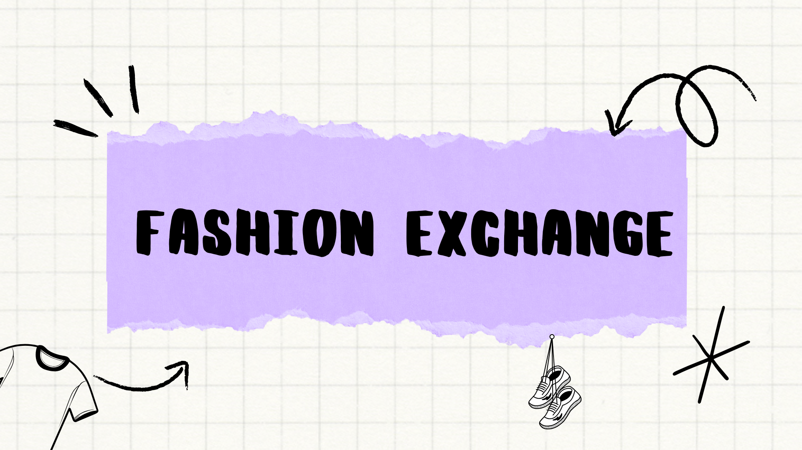

  

  <h3>To know details about the project:</h3>
  
  <a href='https://www.canva.com/design/DAGOgpNaNZI/-SHGfEvIWklq2RG7Sm-tWg/view?utm_content=DAGOgpNaNZI&utm_campaign=designshare&utm_medium=link2&utm_source=uniquelinks&utlId=h8df6a57914#16'>
    <button style="background-color: #48bb78; padding: 8px 16px; color: white; border: none; border-radius: 4px; cursor: pointer;">
      Know More
    </button>
  </a>

<h4>Backend & Other Associated Repositories:</h4>
<ul>
  <li>FX Main Backend: <a href="https://github.com/Adeesh-bode/fx-backend" style="color: #38a169;">Redirect</a></li>
  <li>FX Model: <a href="https://github.com/Adeesh-bode/FXModel" style="color: #38a169;">Redirect</a></li>
</ul>
